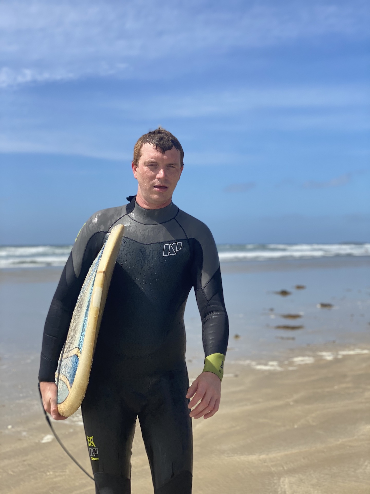

# Bryan Gustin
> *Let's just, keep life simple!*

## "Me, in one sentence"

| D/D/N | Favourite color | Favourite food | pineapple on a pizza|
| :-: | :-: | :-: | :-: |
|10 décembre | Green | TOUUUUUT! | <ul><li>- [ ] Yes</li><li>- [x] NEVER</li></ul> |

## Hobby
Discovering new world:
<ul>
  <li>Antartica</li>
  <li>China</li>
  <li>South Africa</li>
</ul>
Sport:
<ul>
  <li>Rugby</li>
  <li>Jogging</li>
  <li>swimming</li>
</ul>

## You can always count on me when... NO! No you can't!

## A funny story
funny story
### TL;DR
Summarise your funny story in one short sentence.

<< <a href="???" title="Asad">Previous</a>
 || Bryan Gustin || 
<a href="https://github.com/celinearn/markdown-challenge/blob/master/README.md" title="Céline">Next</a> >>
